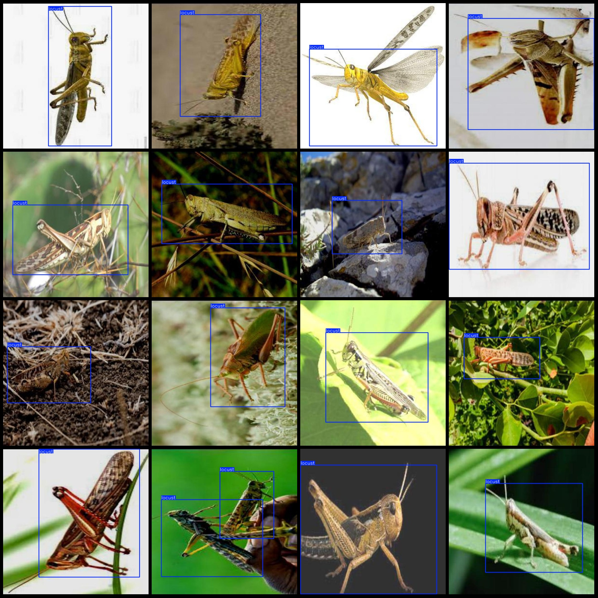
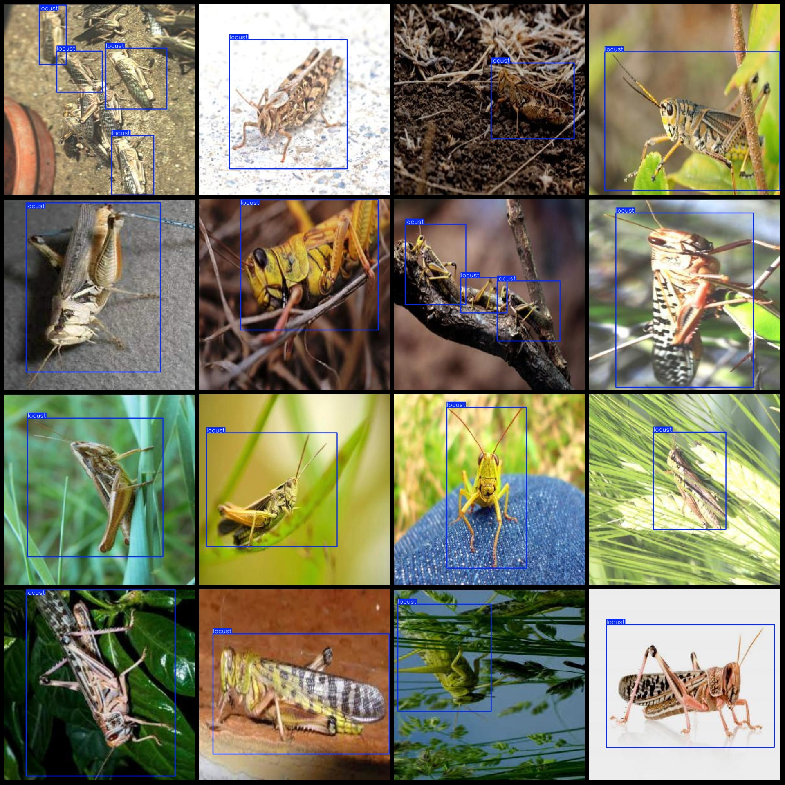

# Pest Detection Data Set VOC+YOLO Format with 1108 Images and Enhanced 1-Classification

The dataset contains 1/3 of the original image and is enhanced by a factor of 1:2.
Dataset format: Pascal VOC format + YOLO format (txt file without split path, only contains jpg images and corresponding VOC format xml file and yolo format txt file)
Number of images (number of jpg files): 1108
The number of XML files is 1108.
The number of txt files is 1108.
The number of categories is 1.
Category Name: ["Locust"]
Number of boxes annotated in each category:
locust number = 1255
Total frame count: 1255
Number of images in each category:
Locust has occupied 1108 images.
Image resolution: 640x640
LabelImg is a powerful labeling tool for image analysis. It can be used to automatically label images with annotations, such as objects, faces, text, and shapes. LabelImg provides a user-friendly interface and supports multiple languages, making it easy to use for researchers, students, and developers.

One of the key features of LabelImg is its ability to work with a wide range of image formats, including JPEG, PNG, BMP, and more. It also supports various image resolutions and sizes, making it suitable for both small and large images. Additionally, LabelImg offers advanced features such as object detection, segmentation, and classification, which can help researchers extract valuable information from their images.

Overall, LabelImg is an essential tool for anyone working with images, whether you are a researcher, student, or developer. Its user-friendly interface and powerful features make it easy to use and highly effective in helping you analyze and understand your images.
Annotation rule: Draw a rectangle around the class.
Important note: The dataset does not have been split into training validation test sets.
Special Notice: This dataset does not guarantee the accuracy of the trained model or weight files.
Preview of the image:
## Image

Here is a pay link on Stripe ( https://buy.stripe.com/3cs8yP7sY87d0vu9AB ). Please contact me lonlonago@foxmail.com after funding $89, and I will send you a complete data files , thank you!

